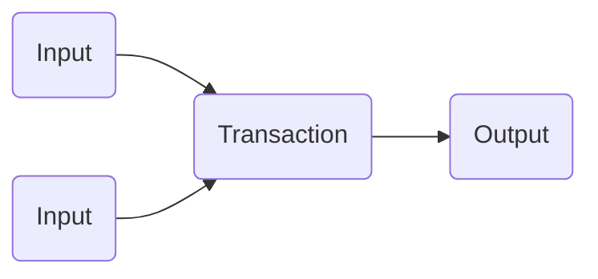

# H1
## H2
### H3

This sentence uses `$` delimiters to show math inline:  $\sqrt{3x-1}+(1+x)^2$

### Scenario 1

```mermaid
graph LR;
    A(Input)-->B(Transaction);
    A1(Input)-->B;
    B-->D(Output);
```